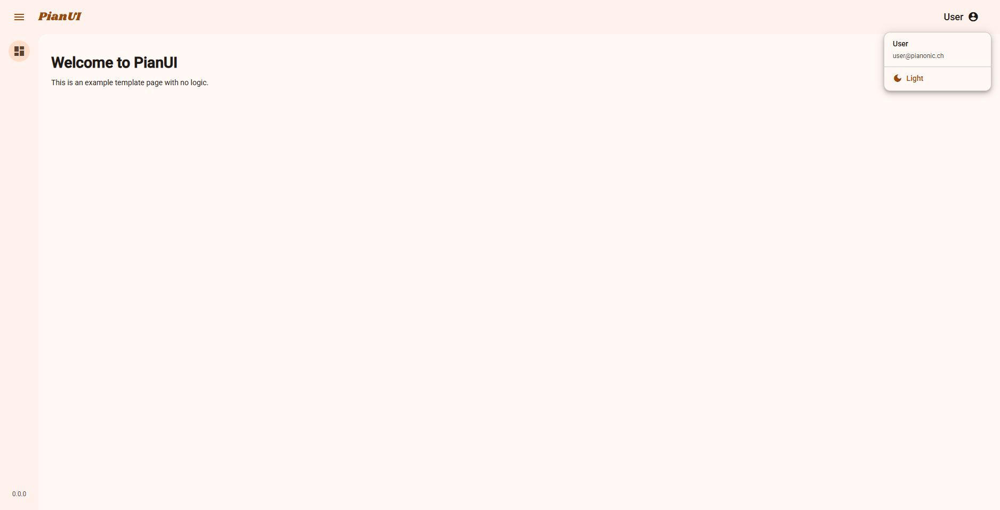
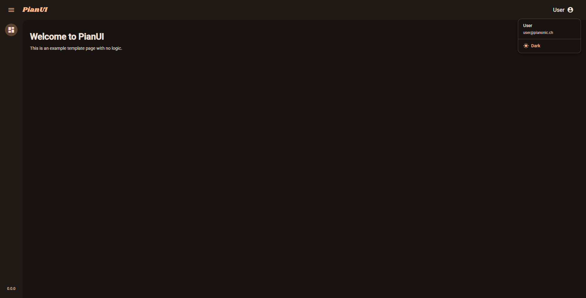

# <p align="center">PianUI</p>
<p align="center">
  
</p>

<p align="center">
  <strong>A modern Angular template with Material Design 3, automatic theming, and responsive design.</strong>
</p>

<p align="center">
  <a href="https://github.com/PianoNic/PianUI"></a>
  <a href="https://github.com/PianoNic/PianUI/blob/main/LICENSE.md"></a>
</p>

## 📸 Screenshots

### Light Mode
<p align="center">
  
  
</p>

### Dark Mode
<p align="center">
  
  
</p>

## ✨ Features
- Automatic theme switching (light/dark/auto)
- Responsive navigation with collapsible sidebar
- Material Design 3 components and theming
- Theme persistence via localStorage
- Angular 21 with signals and standalone components

## 🚀 Getting Started

```bash
bun install
bun start
```

Navigate to [http://localhost:4200/](http://localhost:4200/).

### Build

```bash
bun run build
```

## ⚙️ Theming

Theme modes (accessible via user dropdown menu):
- **Auto**: System preference
- **Light**: Light mode
- **Dark**: Dark mode

Theme preference is saved to localStorage.

## 📜 License
Licensed under the PianUI Attribution License. See [LICENSE](LICENSE.md) for details.

---
<p align="center">Made with ❤️ by <a href="https://github.com/PianoNic">PianoNic</a></p>
<p align="center">
  <a href="https://buymeacoffee.com/pianonic"></a>
</p>
