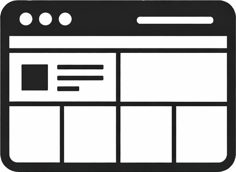
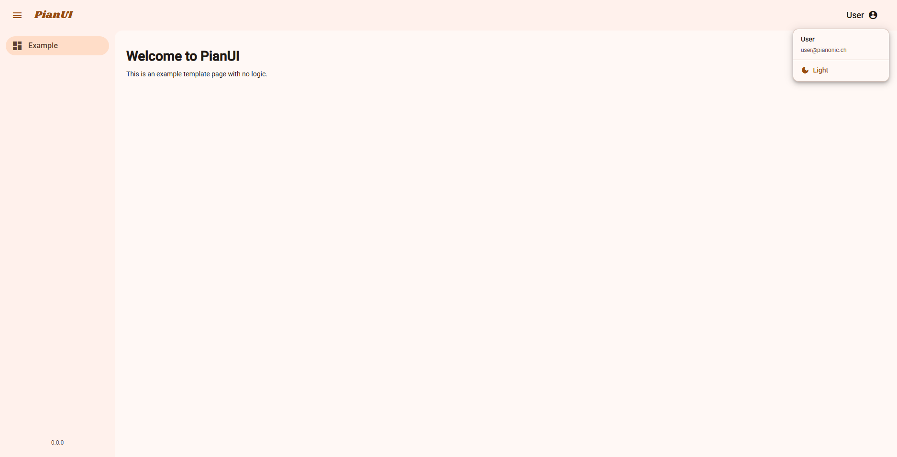
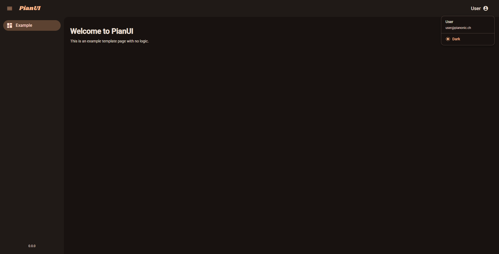

# <p align="center">PianUI</p>
<p align="center">
  
</p>

<p align="center">
  <strong>A modern Angular template built on Material Design 3 principles with automatic theming and responsive design.</strong>
</p>

<p align="center">
  <a href="https://github.com/PianoNic/PianUI"></a>
  <a href="https://github.com/PianoNic/PianUI/blob/main/LICENSE"></a>
</p>

A clean, lightweight Angular template providing a modern, production-ready foundation for building contemporary web applications. Features built-in theming, responsive design, and Material Design 3 components with full dark/light mode support.

## 📸 Screenshots

### Light Mode
<p align="center">
  
  
</p>

### Dark Mode
<p align="center">
  
  
</p>

## ✨ Features
- **Automatic theme switching** between light, dark, and auto (system preference) modes
- **Responsive navigation** with collapsible sidebar that adapts to mobile and desktop
- **Material Design 3** CSS variables for dynamic theme-aware styling
- **Pre-configured services** for layout state management and theme persistence
- **Material 3 typography** and color system with automatic dark/light adaptation
- **Accessibility features** including keyboard navigation and ARIA labels
- **Optimized scrollbars** that respect theme settings
- **Example page** included as a template for new features

## 🏗️ Architecture

The template employs Material Design 3 specifications with comprehensive theme support. Users can seamlessly toggle between automatic (respects system preference), light, and dark modes. The responsive layout automatically adapts to different viewport sizes using **Angular CDK breakpoint observers**, ensuring optimal viewing on mobile, tablet, and desktop displays.

All text uses Material 3 CSS variables (`--mat-sys-on-surface`, `--mat-sys-on-surface-variant`, etc.) ensuring they automatically adapt to the selected theme. The application is organized with a modular architecture featuring layout components in `src/app/layout/`, shared services in `src/app/shared/services/`, and reusable components in `src/app/shared/components/`.

## 🚀 Getting Started

### Development Server

```bash
npm install
npm start
```

Navigate to [http://localhost:4200/](http://localhost:4200/). The application will automatically reload when you make changes to the source files.

### Build for Production

```bash
npm run build
```

The build artifacts will be stored in the `dist/` directory.

## ⚙️ Theming System

The application supports three theme modes accessible via the theme toggle in the user dropdown menu (top-right corner):

- **Auto**: Respects the system's color-scheme preference
- **Light**: Forces light mode
- **Dark**: Forces dark mode

Theme preference is automatically saved to localStorage and restored on subsequent visits. All UI elements adapt instantly when switching themes.

## 🛠️ Technical Details

PianUI is built with **Angular 21** using standalone components and **signals-based state management**. The theming system leverages Material 3 CSS variables that automatically update when themes change. The layout service manages responsive behavior and sidebar state, while the theme service handles persistence to localStorage and dynamic color-scheme switching. Styling uses **SCSS** with Material Design 3 system variables for full theme compatibility.

## 🚀 Deployment

Build the application using the Angular CLI with `npm run build` and deploy the generated `dist/` directory to any static hosting service. The application supports deployment to traditional web servers or containerized environments using Docker.

## 📜 License
This project is licensed under the MIT License. See [LICENSE](LICENSE) for details.

---
<p align="center">Made with ❤️ by <a href="https://github.com/PianoNic">PianoNic</a></p>
<p align="center">
  <a href="https://buymeacoffee.com/pianonic"></a>
</p>